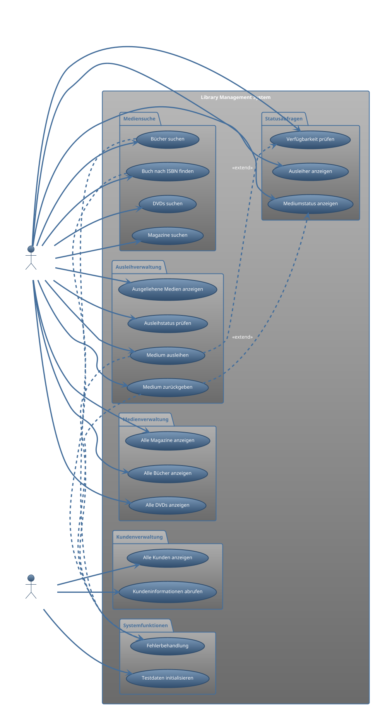

# UML Anwendungsfalldiagramm - Library Management System

## Use Case Diagramm in PlantUML Notation

## Detaillierte Use Case Beschreibungen

### 1. Mediensuche
- **Bücher suchen**: Regex-basierte Suche nach Titel oder Autor
- **DVDs suchen**: Regex-basierte Suche nach Titel
- **Magazine suchen**: Regex-basierte Suche nach Titel
- **Buch nach ISBN finden**: Exakte Suche über ISBN-Nummer

### 2. Medienverwaltung
- **Alle Bücher/DVDs/Magazine anzeigen**: Vollständige Auflistung aller verfügbaren Medien

### 3. Kundenverwaltung
- **Alle Kunden anzeigen**: Übersicht aller registrierten Kunden
- **Kundeninformationen abrufen**: Details zu einzelnen Kunden

### 4. Ausleihverwaltung
- **Medium ausleihen**: 
  - Vorbedingung: Kunde existiert, Medium verfügbar, max. 5 Medien pro Kunde
  - Nachbedingung: Medium dem Kunden zugeordnet, Verfügbarkeit reduziert
- **Medium zurückgeben**:
  - Vorbedingung: Medium wurde vom Kunden ausgeliehen
  - Nachbedingung: Medium vom Kunden entfernt, Verfügbarkeit erhöht
- **Ausgeliehene Medien anzeigen**: Liste aller von einem Kunden ausgeliehenen Medien

### 5. Statusabfragen
- **Verfügbarkeit prüfen**: Anzahl verfügbarer Exemplare
- **Mediumstatus anzeigen**: Detaillierte Verfügbarkeitsinformation
- **Ausleiher anzeigen**: Welche Kunden haben ein bestimmtes Medium ausgeliehen

### 6. Systemfunktionen
- **Testdaten initialisieren**: Automatisches Laden von Beispieldaten beim Start
- **Fehlerbehandlung**: Globale Exception-Behandlung

## Akteure

### Bibliotheksbenutzer
- Primärer Akteur für alle Medien- und Ausleihfunktionen
- Kann Medien suchen, ausleihen, zurückgeben und Status abfragen

### System Administrator
- Verwaltung von Kundendaten
- System-Initialisierung und -Wartung

## Geschäftsregeln
1. **Ausleihlimit**: Max. 5 Medien pro Kunde gleichzeitig
2. **Verfügbarkeitsprüfung**: Nur verfügbare Medien können ausgeliehen werden
3. **Eindeutige Identifikation**: Alle Entitäten haben UUID als Primärschlüssel
4. **Regex-Unterstützung**: Flexible Suchfunktionen mit Pattern Matching