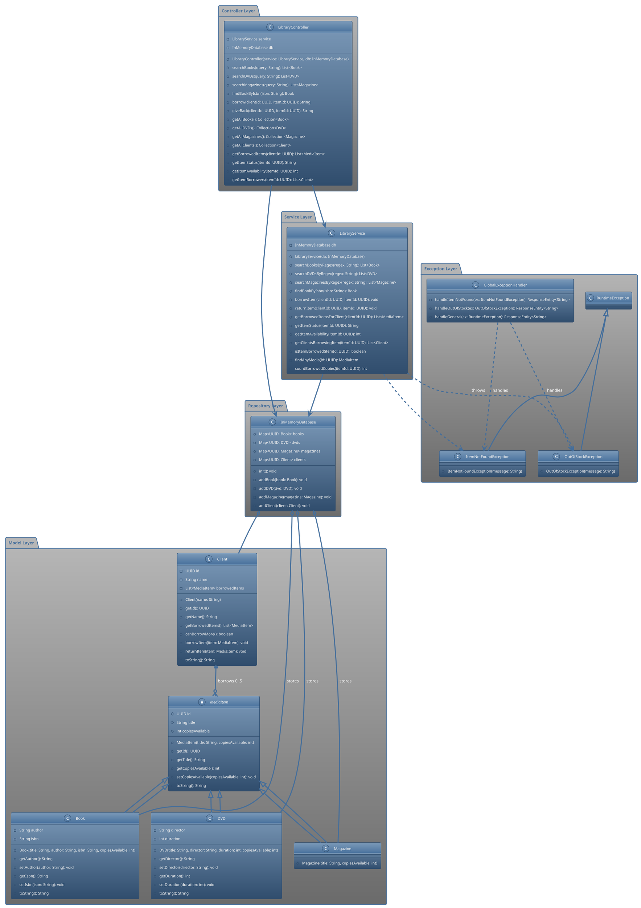

# UML Klassendiagramm - Library Management System

## Klassendiagramm in PlantUML Notation

## Erklärung der Klassenstruktur

### Model Layer (Domain Objects)
- **MediaItem**: Abstrakte Basisklasse für alle ausleihbaren Medien
- **Book, DVD, Magazine**: Konkrete Implementierungen verschiedener Medientypen
- **Client**: Repräsentiert Bibliothekskunden mit Ausleihfunktionalität

### Repository Layer
- **InMemoryDatabase**: Zentrale Datenhaltung mit Hash-Maps für alle Entitäten

### Service Layer
- **LibraryService**: Business Logic für Suche, Ausleihe und Statusabfragen

### Controller Layer
- **LibraryController**: REST-Endpunkte für die API

### Exception Layer
- **Custom Exceptions**: Spezifische Fehlerbehandlung
- **GlobalExceptionHandler**: Zentrale HTTP-Fehlerbehandlung

### Wichtige Designprinzipien
1. **Vererbung**: MediaItem als abstrakte Basisklasse
2. **Dependency Injection**: Service und Repository werden injiziert
3. **Separation of Concerns**: Klare Trennung der Layer
4. **Exception Handling**: Custom Exceptions mit globalem Handler