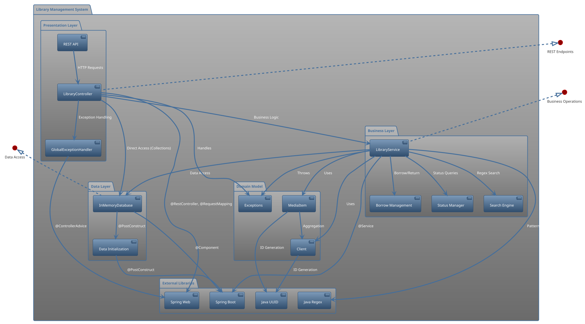
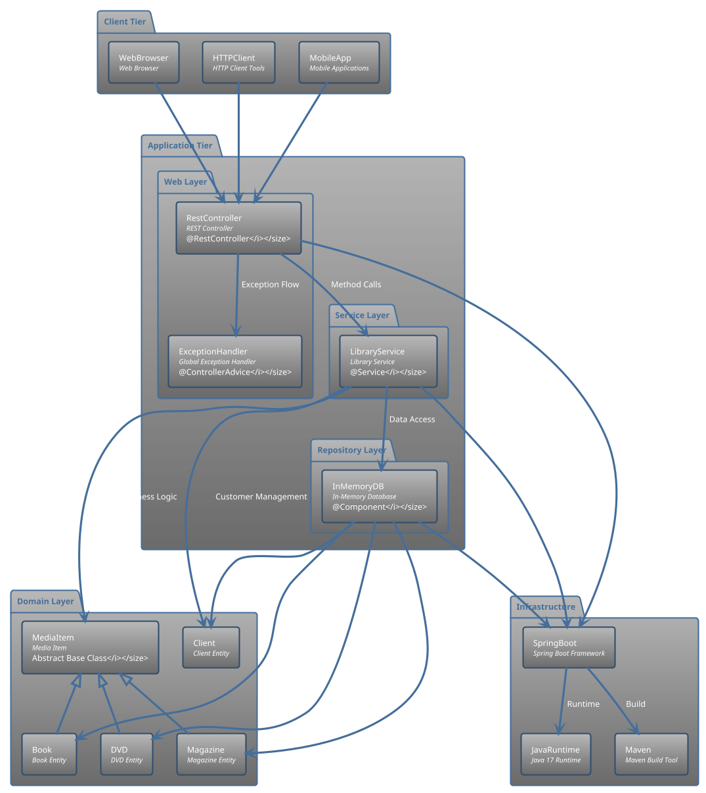
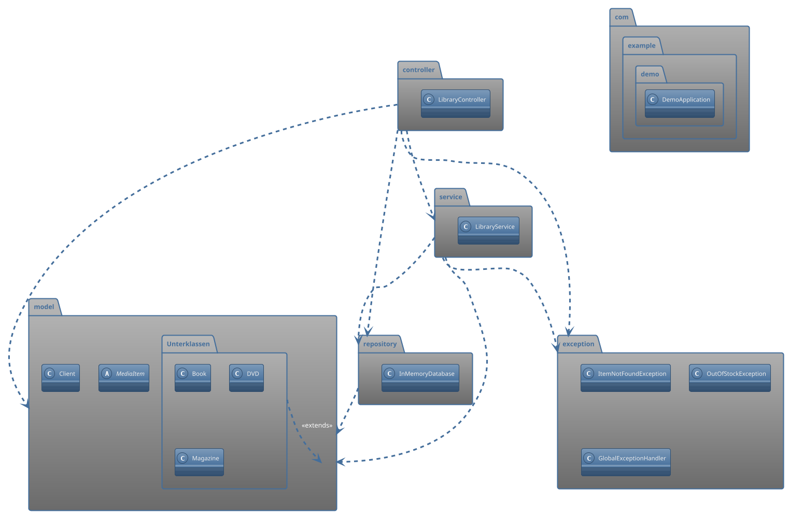

# UML Komponentendiagramm - Library Management System

## Komponentendiagramm in PlantUML Notation

## Systemarchitektur Diagramm

## Package Diagramm

## Erklärung der Komponentenarchitektur

### 1. Presentation Layer
- **REST API**: Eingangsschicht für HTTP-Requests
- **LibraryController**: Orchestriert Request-Handling
- **GlobalExceptionHandler**: Zentrale Fehlerbehandlung

### 2. Business Layer
- **LibraryService**: Kerngeschäftslogik
- **Search Engine**: Regex-basierte Suchfunktionalität
- **Borrow Management**: Ausleihe- und Rückgabelogik
- **Status Manager**: Verfügbarkeits- und Statusabfragen

### 3. Data Layer
- **InMemoryDatabase**: Zentrale Datenhaltung
- **Data Initialization**: Testdaten-Setup

### 4. Domain Model
- **MediaItem Hierarchie**: Objektorientierte Medienmodellierung
- **Client Model**: Kundenrepräsentation
- **Exception Model**: Domänenspezifische Exceptions

### 5. External Dependencies
- **Spring Boot/Web**: Framework-Komponenten
- **Java Utilities**: UUID, Regex Pattern Matching

## Architektur-Prinzipien

### Layered Architecture
- Klare Trennung von Präsentation, Geschäftslogik und Datenhaltung
- Dependency Injection für lose Kopplung

### Domain-Driven Design
- Zentrale Domänenmodelle mit Vererbungshierarchie
- Geschäftsregeln in Service-Layer gekapselt

### Spring Boot Integration
- Annotation-basierte Konfiguration
- Automatische Bean-Registrierung und -Injection

### Error Handling Strategy
- Custom Exceptions für Domänenfehler
- Globaler Exception Handler für HTTP-Response-Mapping