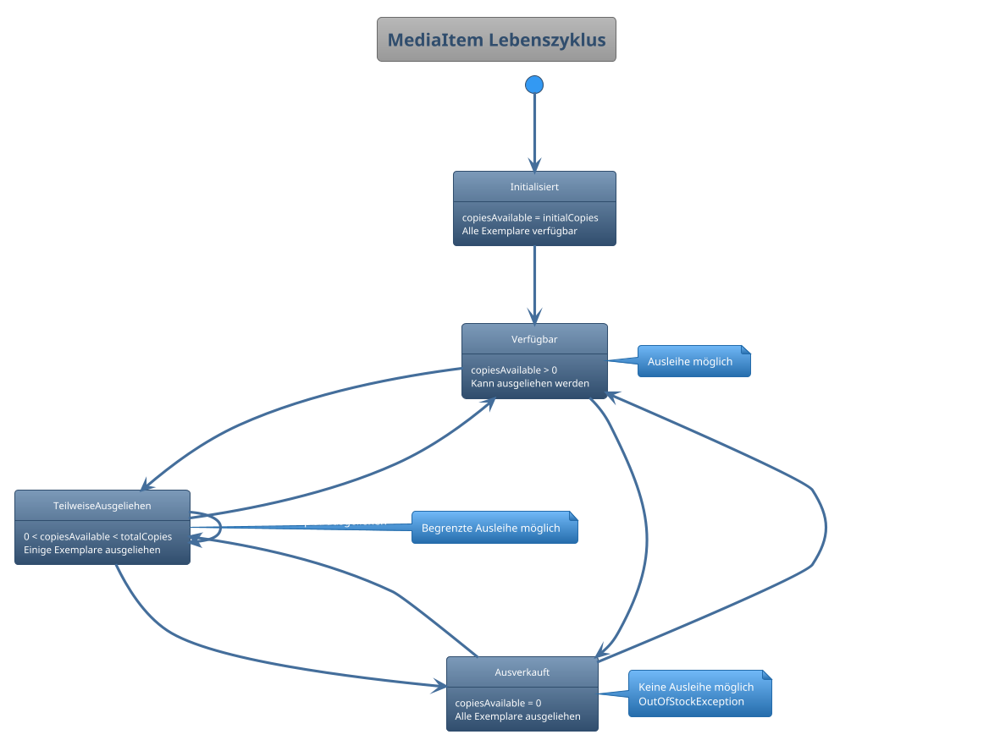
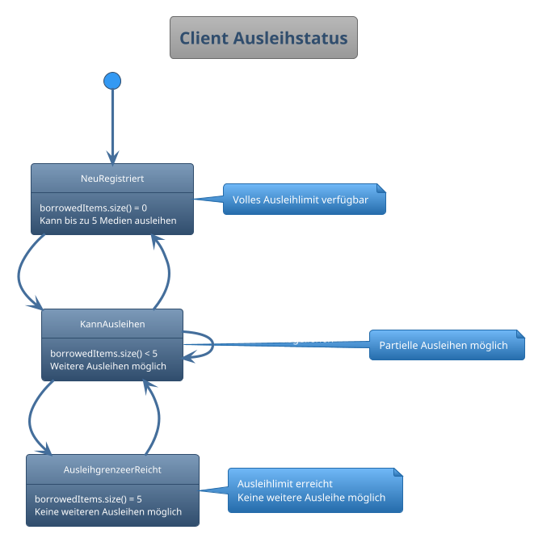
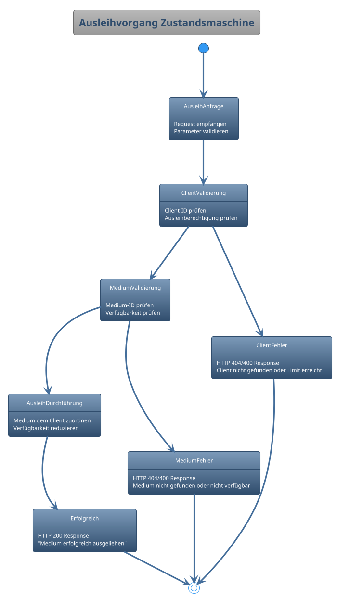
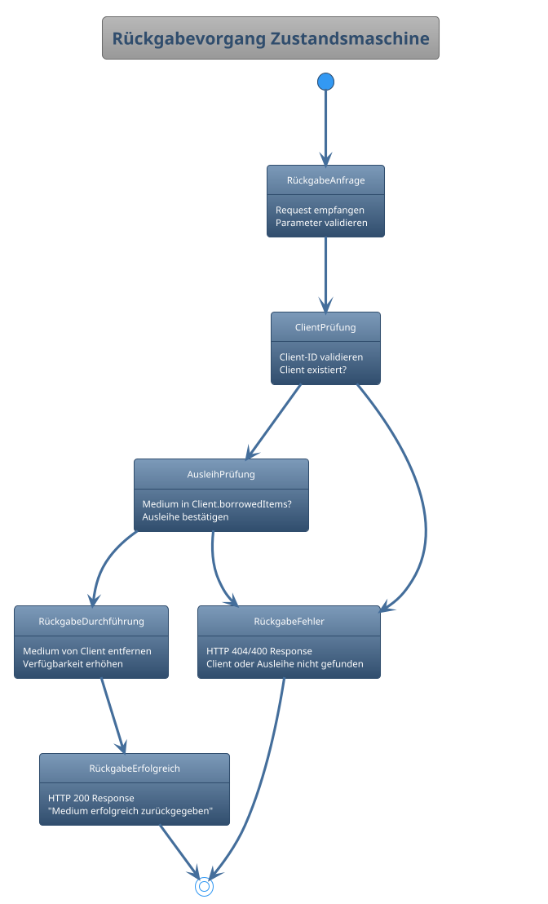

# UML Zustandsdiagramm - Library Management System

## Zustandsdiagramm für MediaItem Lebenszyklus

## Zustandsdiagramm für Client Ausleihstatus

## Zustandsdiagramm für Ausleihvorgang

## Zustandsdiagramm für Rückgabevorgang

## Erklärung der Zustandsdiagramme

### 1. MediaItem Lebenszyklus
- **Zustände**: Basieren auf der Anzahl verfügbarer Exemplare
- **Übergänge**: Ausgelöst durch Ausleihe- und Rückgabeaktionen
- **Geschäftsregeln**: Ausleihe nur bei verfügbaren Exemplaren möglich

### 2. Client Ausleihstatus
- **Zustände**: Definiert durch Anzahl ausgeliehener Medien
- **Geschäftsregel**: Maximum 5 Medien pro Client
- **Übergänge**: Basierend auf Ausleihe- und Rückgabeaktionen

### 3. Ausleihvorgang
- **Prozess-Zustände**: Validierung → Durchführung → Ergebnis
- **Fehlerbehandlung**: Separate Fehlerzustände für verschiedene Szenarien
- **Transaktionale Sicherheit**: Atomare Operation

### 4. Rückgabevorgang
- **Validierungsschritte**: Client- und Ausleihprüfung
- **Geschäftslogik**: Nur tatsächlich ausgeliehene Medien können zurückgegeben werden
- **Ergebnisbehandlung**: Erfolg oder spezifische Fehlermeldungen

## Zustandsübergänge und Ereignisse

### Ereignisse
- **borrowItem()**: Löst Ausleihe aus
- **returnItem()**: Löst Rückgabe aus  
- **HTTP Requests**: Externe Trigger
- **Validation Results**: Interne Zustandsübergänge

### Bedingungen (Guards)
- **copiesAvailable > 0**: Verfügbarkeitsprüfung
- **borrowedItems.size() < 5**: Ausleihlimit-Prüfung
- **Client exists**: Existenzvalidierung
- **Item is borrowed by client**: Ausleihe-Beziehung